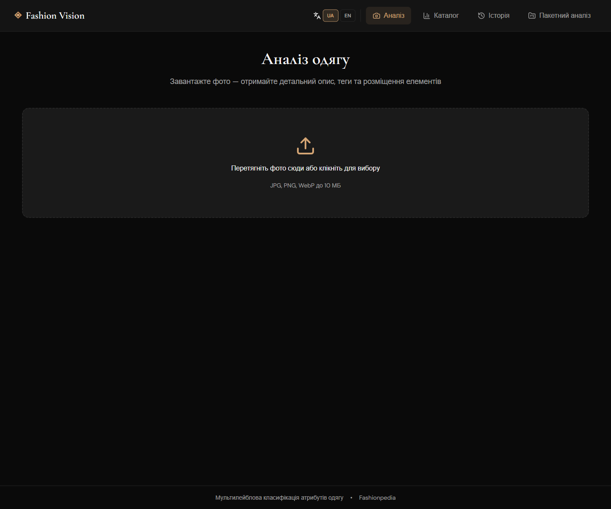
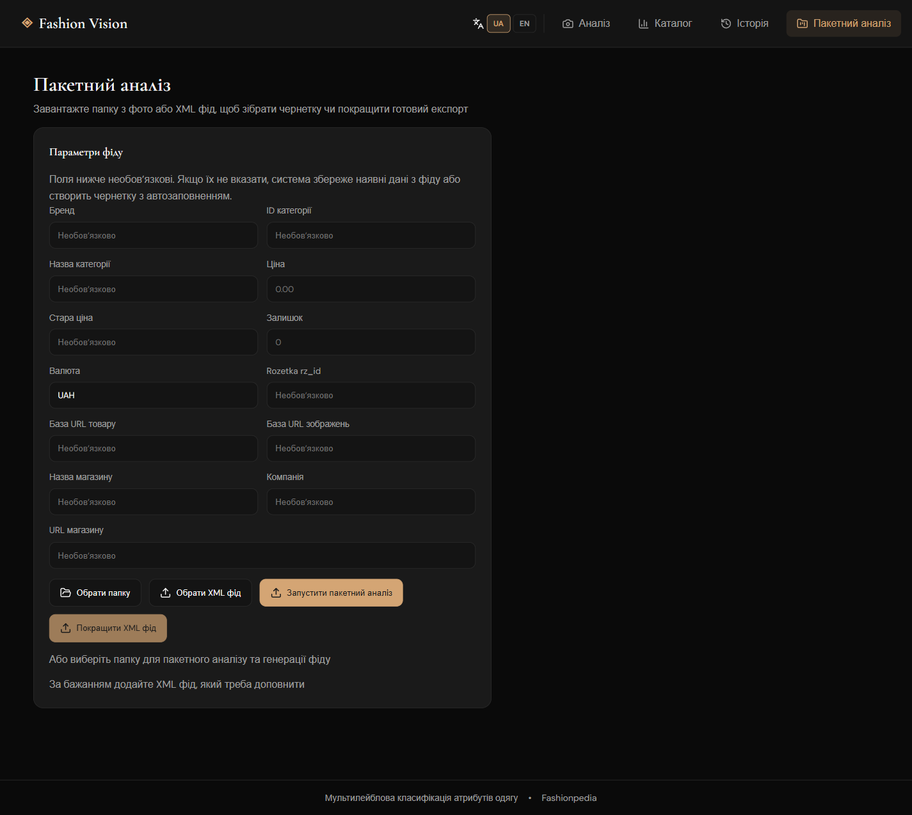
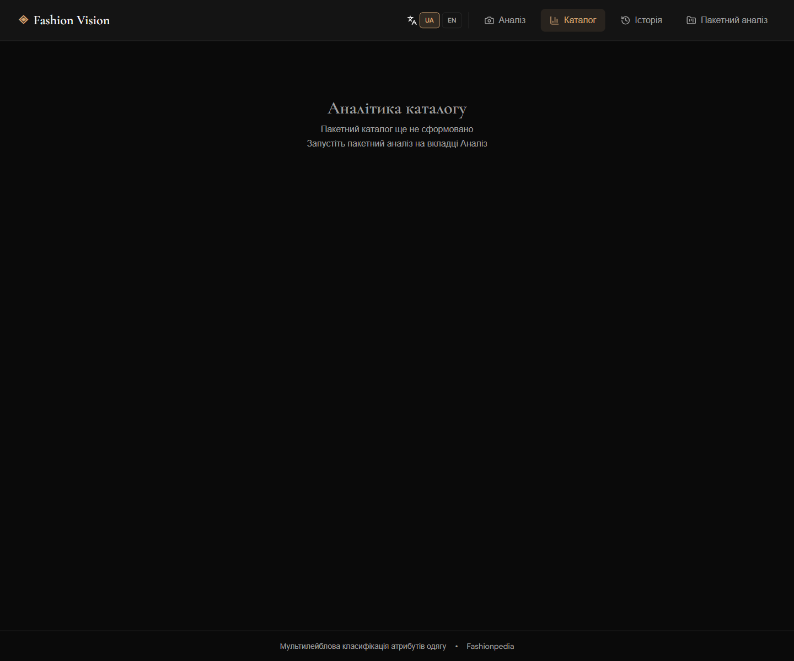
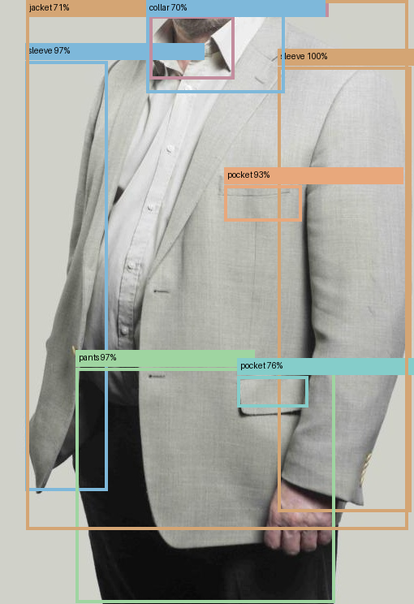

# Fashion Vision

Fashion Vision is a full-stack application for clothing image analysis and marketplace feed preparation. It combines a FastAPI backend, PyTorch-based computer vision models, and a React frontend for interactive analysis, batch processing, and catalog review.

The project is designed for two connected tasks:

- visual analysis of clothing items from product images
- generation and enrichment of draft marketplace feeds for product catalogs

## What the Project Does

The application supports:

- single-image analysis with detected garment elements and predicted attributes
- batch processing for folders of product images
- draft XML feed generation for catalog export
- enrichment of an existing XML feed with additional characteristics inferred from images
- catalog analytics and attribute-based search

## Method Overview

The pipeline combines classification and detection models in one workflow.

### 1. Attribute Classification

A multi-label classifier predicts clothing attributes such as:

- color
- pattern
- material
- sleeve or neckline-related features
- high-level product type signals

The backend can load local checkpoints based on:

- ResNet50
- EfficientNet-B0
- ConvNeXt

### 2. Garment Element Detection

A YOLOS-based detector identifies visible fashion elements and garment regions in the image. Detection results are then combined with attribute predictions to build a richer representation of each product.

### 3. Catalog Item Synthesis

For each analyzed image, the backend builds a normalized catalog item with:

- generated product title
- generated short description
- detected and inferred characteristics
- grouped item metadata for feed export

### 4. Feed Drafting and Feed Enrichment

The system supports two export flows:

- create a draft feed from a folder of product images
- import an existing XML feed and enrich incomplete offers using image analysis

If commercial fields such as price or stock are missing, the system can still produce a draft-oriented export instead of blocking the workflow.

## Interface

The frontend includes separate pages for:

- image analysis
- batch processing
- catalog analytics
- analysis history

## Screenshots

### Home Page



### Batch Processing



### Catalog Analytics



## Example Analysis

The repository includes a public demo example based on a cropped dataset image where the face is removed.

### Sample Input


### Sample Detection Output



### Sample Predicted Results

- Top predicted tags: `blazer`, `single breasted`, `notched (lapel)`, `shirt (collar)`, `set-in sleeve`, `welt (pocket)`
- Strong detected elements: `pants`, `sleeve`, `collar`, `pocket`
- Example summary: `Detected pants and jacket-related structure with blazer, single-breasted construction, notched lapel, shirt collar, sleeves, and pocket details`

## Project Structure

```text
fashion-project-clean/
├── docs/
│   ├── demo/
│   └── screenshots/
├── fashion_frontend/
├── fashion_ml_backend/
├── .gitignore
└── README.md
```

## Tech Stack

- Frontend: React, TypeScript, Vite
- Backend: FastAPI
- Deep Learning: PyTorch, Transformers
- Detection Model: YOLOS
- Data Utilities: NumPy, Pillow, scikit-learn

## Local Setup

### 1. Clone the Repository

```bash
git clone https://github.com/MaxSaiets/Fashion_Vision.git
cd Fashion_Vision
```

### 2. Start the Backend

```bash
cd fashion_ml_backend
python -m venv venv
venv\Scripts\activate
pip install -r requirements.txt
uvicorn api_server:app --reload --host 127.0.0.1 --port 8000
```

The backend API will be available at `http://127.0.0.1:8000`.

### 3. Start the Frontend

Open a second terminal:

```bash
cd fashion_frontend
npm install
npm run dev -- --host 127.0.0.1 --port 5173
```

The frontend will be available at `http://127.0.0.1:5173`.

## Model Files

The application can run with local model checkpoints when they are placed in:

```text
fashion_ml_backend/outputs/
```

Typical local artifacts include:

- classification checkpoints such as `best_crop_resnet50.pt`
- a local YOLOS directory such as `best_yolos_fashionpedia`

If a local detector is not available, detection-related behavior may be limited until the model is added.

## Dataset Support

The backend supports two dataset modes:

- `huggingface`
- `fashionpedia_json`

For local Fashionpedia-style experiments, expected assets are placed under:

```text
fashion_ml_backend/data/
```

The repository does not include full dataset files, large caches, or generated training outputs.

## Batch Feed Workflow

### Draft Feed from Images

1. Open the `Batch` page in the frontend.
2. Upload a folder of product images.
3. Optionally fill in feed metadata.
4. Run batch analysis.
5. Download generated XML feeds and catalog artifacts.

### Enrich an Existing XML Feed

1. Open the `Batch` page.
2. Upload an existing XML feed.
3. Optionally upload related product images.
4. Run feed enrichment.
5. Download the enriched feed output.

Generated job artifacts are stored under:

```text
fashion_ml_backend/outputs/jobs/<job_id>/
```

Each job can contain:

- uploaded inputs
- `manifest.json`
- `catalog.json`
- `rozetka_feed.xml`
- `kasta_feed.xml`

## Testing

### Backend

```bash
cd fashion_ml_backend
pytest
```

### Frontend

```bash
cd fashion_frontend
npm test
```

### Frontend Production Build

```bash
cd fashion_frontend
npm run build
```

## Notes

- The interface supports both Ukrainian and English.
- Batch processing is available as a separate top-level navigation page.
- Feed generation is draft-oriented by default and can work with incomplete business metadata.
